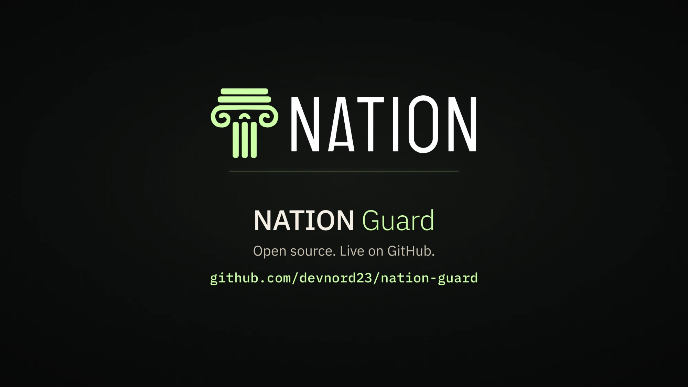
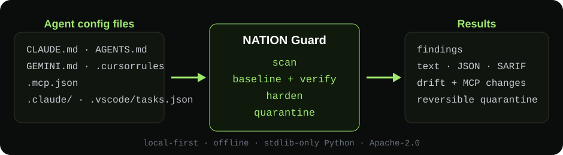

<!-- SPDX-License-Identifier: Apache-2.0 -->
<p align="center">
  
</p>

<h1 align="center">NATION Guard</h1>

<p align="center"><strong>Prompt-injection scanner &amp; integrity tool for AI agent instruction/config files.</strong></p>

<p align="center">Experimental · local-first · offline · stdlib-only Python (3.9+) · Apache-2.0</p>

---

## What NATION Guard solves

AI coding agents — Claude Code, Cursor, Gemini, Copilot and friends — read files
like `CLAUDE.md`, `AGENTS.md`, `GEMINI.md`, `.cursorrules`, `.mcp.json` and
`.vscode/tasks.json` as **trusted instructions**. Anyone who can land text in one
of those files (a pull request, a dependency or template, a copied snippet, a
document the agent ingests) can tell every agent that opens the repo to
exfiltrate secrets, disable its own guardrails, auto-run code, or copy the
payload into the next project — a prompt-injection **worm**.

NATION Guard treats those files as the attack surface they are:

- **Scan** them for injection / exfiltration / auto-exec / permission-weakening
  patterns — seeing through invisible characters, Unicode-tag smuggling,
  homoglyphs, HTML entities and base64, so a disguised payload is caught the
  same as a plain one.
- **Baseline + verify** to catch tampering — changed, new or removed config
  files and MCP-server changes — even when the wording is novel.
- **Harden** (best-effort) and **quarantine** suspicious files, reversibly.
- Plug in as a **Claude Code hook** or a read-only **MCP server**.

<p align="center">
  
</p>

## Quick start

```bash
# Python 3.9+, no dependencies. From a clone of this repo:
pip install .                   # not yet published to PyPI

# 1. Scan the current project for unsafe/injected instructions.
nation-guard scan

# 2. Record a trusted baseline, then later detect drift / tampering.
nation-guard baseline
nation-guard verify

# 3. Best-effort freeze of instruction files (advisory; dry-run first).
nation-guard harden            # shows what it would do
nation-guard harden --apply    # drop write bits + pre-create read-only stubs
nation-guard harden --undo     # revert exactly what it changed

# Machine-readable output for CI (exit 1 on a finding at/above --fail-on):
nation-guard scan --format sarif --fail-on high > nation-guard.sarif
```

Pull a malicious file out of the tree (reversibly) and put it back later:

```bash
nation-guard capture ./AGENTS.md     # moves it to ~/.nation-guard/quarantine
nation-guard quarantine list
nation-guard restore <id>
```

## What it detects

| ID            | Severity | What |
|---------------|----------|------|
| NG-WORM-001   | critical | Instruction that copies itself into other agent files/repos |
| NG-OVR-001/002| high/med | Instruction-override attempts; forged `<system>`/`[admin]` markers |
| NG-EXF-001/002| crit/med | A secret store / named secret near a data-sending command |
| NG-CON-001    | high     | Telling the agent to hide its activity from the user |
| NG-AUTO-001/2/3| high/med| `curl \| bash`; `SessionStart` hooks; `tasks.json` `folderOpen` |
| NG-PERM-001/2 | high/med | `Bash(*)`, `bypassPermissions`, yolo mode; auto-enabled MCP servers |
| NG-HID-001/2/3| med/high | Invisible chars, Unicode tag smuggling, rule hits in hidden content |
| NG-INT-001..3, NG-MCP-001 | mixed | Baseline drift (changed/new/removed files, MCP entry changes) |

Run `nation-guard rules list` for the full catalogue.

## Use it as a Claude Code hook

NATION Guard ships a hook that vets edits to config files, warns on injected
tool output, and blocks worm propagation through sub-agents/outgoing messages:

```bash
nation-guard hooks print          # prints a settings.json fragment to copy
nation-guard hooks print --block  # deny (instead of ask) on config writes
```

It **prints** the fragment; it never edits your config for you.

**Enforcement is the host runtime's, not NATION Guard's.** The hook emits a
decision (`ask`/`deny`) or a warning on stdout; whether that actually blocks a
tool call depends entirely on the agent runtime honouring it. The hook fails
closed on malformed recognised events (returns a protective decision), but how
the runtime treats a hook that errors, exits non-zero, or exceeds its timeout
is runtime-defined — for Claude Code, a `PreToolUse` hook that does not return
a decision falls back to the normal permission flow, so a hard crash or timeout
is **not** guaranteed to block. Keep hook commands fast and prefer `--block`
where a hard denial matters.

## Use it as an MCP server

A read-only MCP stdio server exposes `scan`, `check_integrity` and
`blast_radius` to an agent, limited to a `--root`:

```bash
nation-guard-mcp --root .
```

## How it works

- [`guard/nation_guard/targets.py`](guard/nation_guard/targets.py) — which files count as agent config.
- [`guard/nation_guard/normalize.py`](guard/nation_guard/normalize.py) — de-obfuscation "views" + raw-byte signals.
- [`rules/core.yaml`](rules/core.yaml) — the detections, as reviewable data.
- [`guard/nation_guard/integrity.py`](guard/nation_guard/integrity.py) — baselines and drift.
- State lives in `~/.nation-guard` (override with `NATION_GUARD_HOME`), never inside a scanned project.

See [`docs/threat-model.md`](docs/threat-model.md), [`docs/privacy.md`](docs/privacy.md), [`docs/roadmap.md`](docs/roadmap.md) and the honest [`docs/known-gaps.md`](docs/known-gaps.md).

## Development & verification

No dependencies to install for development (Python 3.9+). Exact commands:

```bash
# Run the full test suite (122 tests; 3 symlink tests skip without symlink perms).
python -m unittest discover -s tests -p "test_*.py" -v

# Static check for known network/subprocess/dynamic-import constructs in guard/.
python tools/check_no_network.py

# Regenerate the obfuscated corpus fixtures (must produce no diff).
python corpus/generate.py && git diff --exit-code -- corpus/

# Build a real wheel + sdist (needs `build`/`setuptools`, build-time only).
python -m pip install --upgrade build
python -m build

# Install the wheel into a clean virtualenv and smoke-test it.
python -m venv /tmp/ngvenv
/tmp/ngvenv/bin/pip install dist/*.whl          # Windows: \ngvenv\Scripts\pip
/tmp/ngvenv/bin/nation-guard --version
/tmp/ngvenv/bin/nation-guard rules list          # bundled rules load from the package
/tmp/ngvenv/bin/nation-guard scan --root .
```

CI (`.github/workflows/ci.yml`) is **configured** to run the suite on
ubuntu/windows/macOS × Python 3.9/3.12, build and clean-install the wheel, and
scan the repo itself. **It is not currently running:** Actions runs for this
repository fail at startup, before any job begins (`startup_failure`, 0 jobs).
The workflow file parses and is registered active, so the cause is **not** the
YAML; the actual cause is **unconfirmed**. Until that is resolved, the
cross-platform/Python-3.9 results above are **not available** — the only
executed results are the self-reported Windows/CPython 3.12 run.

## License

Apache-2.0. See [`LICENSE`](LICENSE) and [`NOTICE`](NOTICE).
